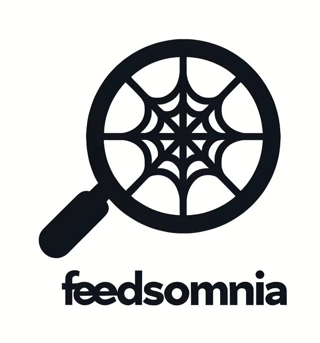

# Feedsomnia

## Introduction

Feedsomnia is designed to simplify the process of searching for used items across various classified ad websites. Instead of manually visiting each site, Feedsomnia automates the search, allowing you to monitor new ads in real-time and quickly find the best deals.

## The Problem

Manually searching multiple classified ad websites for specific items is time-consuming and inefficient. Users need a streamlined way to access all relevant listings in one place.

## The Solution

Feedsomnia consolidates classified ads from multiple websites into a single searchable platform. This automation allows you to:

- Monitor new ads in real-time.
- Search for items across multiple sites with a single query.
- Quickly contact sellers to secure the best deals.

## How It Works

Feedsomnia employs web scraping to collect data from various classified ad websites. This data is stored in a centralized database and queried based on user input. The user interface provides robust filtering options and displays ads in an organized, user-friendly format.

## Features

- **Time-Saving**: Eliminates the need to manually visit multiple websites.
- **Efficiency**: Instantly access all available ads that match your search criteria.
- **Competitive Advantage**: Be the first to contact sellers when new ads are posted.

## Usage

1. **Search**: Enter keywords for the items you are looking for.
2. **Filter**: Select a country to filter results by location.
3. **View Results**: Browse the list of classified ads.
4. **Contact Sellers**: Click on the ad title to view details and contact the seller.

## Philosophy

Feedsomnia is built on the principle of making online classifieds more accessible and efficient. By automating the search process and centralizing ad listings, we aim to save users time and effort, providing them with a competitive edge in finding the best deals. Our commitment to open source ensures that the community can contribute to and benefit from continuous improvements.

## Future Plans

- Add more websites to the scraping list.
- Enhance filtering options.
- Implement notifications for new listings.

## License

This project is licensed under the GNU General Public License v3.0 - see the [LICENSE](LICENSE) file for details.

## Contributing

Contributions are welcome! Please fork this repository and submit a pull request for review.

## Acknowledgments

Special thanks to the developers and contributors who support the free software.

## Short Description

Feedsomnia is a web app that consolidates and simplifies the search for used items across multiple classified ad websites.
